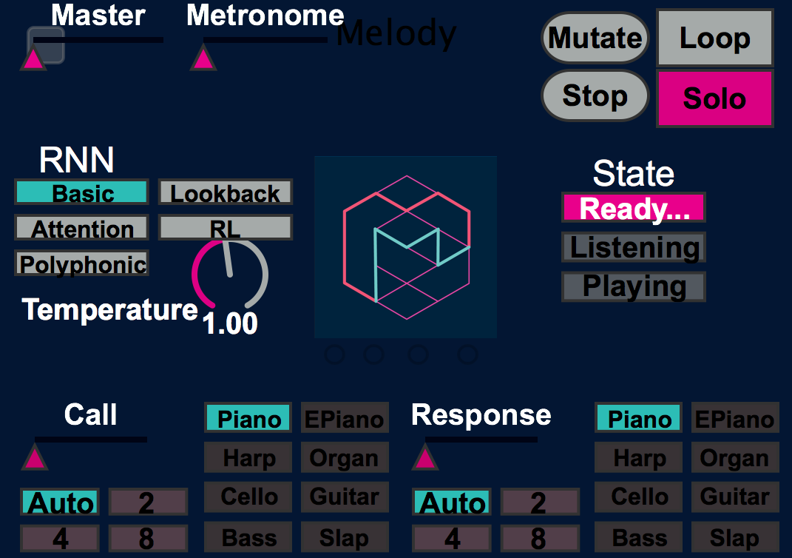

# Interactive Musical Improvisation with Magenta (NIPS 2016)

This folder contains download instructions and the source code required to run the call and response demo that won "Best Demo" at NIPS 2016.

You can watch a video of the demo in action on our
[blog](https://magenta.tensorflow.org/2016/12/16/nips-demo/).

__DISCLAIMER__
> This demo uses Magenta, Ableton Live, MaxMSP, and Mira. It also only works on OSX. As a fair warning, it will take a bit of familiarity with this software for you to successfully connect all the pieces. It was developed specifically for the NIPS conference and is not designed around easy installation and maintenance.

> If you do not have access to these pieces of software, a
[simplified version](/magenta/interfaces/midi) of the demo without these
dependencies is also available.

With those disclaimers aside, many have found the experience of jamming with it to be quite fluid and fun, and we hope you do too. Also, this is _FAR_ from the only way to connect Magenta to a musical workstation, and we encourage you to come up with others and share. We'd love to see and host example interactions with other (and especially free) software such as Supercollider, Pure Data, etc. At the very least, perhaps you can use this demo as an example and launching point for integrating Magenta with your own preferred musical workflow.

Here is a diagram of the way MIDI is routed in the demo:

  

# Installation Instructions:

## Download this directory

Download this demo directory `NIPS_2016` with the included shell scripts. The simplest way to do this is to clone the magenta repo.

## Install Magenta (MIDI Generation)

Follow the [Magenta installation instructions](https://github.com/tensorflow/magenta) to install a pip package of magenta. If you've done it correctly you should be able to run the command `magenta_midi` from the command line.

## Download Bundles (Pretrained Models)

The demo uses several models pretrained on a large MIDI corpus. You need to download them all into the demo directory.

* [Basic RNN](http://download.magenta.tensorflow.org/models/basic_rnn.mag)
* [Lookback RNN](http://download.magenta.tensorflow.org/models/lookback_rnn.mag)
* [Attention RNN](http://download.magenta.tensorflow.org/models/attention_rnn.mag)
* [RL-Tuned RNN](http://download.magenta.tensorflow.org/models/rl_rnn.mag)
* [Polyphony RNN](http://download.magenta.tensorflow.org/models/polyphony_rnn.mag)
* [Drum Kit RNN](http://download.magenta.tensorflow.org/models/drum_kit_rnn.mag)

You can of course train your own models and bundle them, and swap them in and out for the pretrained models.

## Install MaxMSP 7 (MIDI Control)

We use [Max](https://cycling74.com/) as a frontend UI that simply sends MIDI control values to control Ableton and Magenta. This is not a strict requirement, as most MIDI controllers could be appropriately mapped to replace this user-friendly frontend.

## Download Max Patches

Once you install Max, you should download the patches and resources into the demo directory:

* [Magenta Max Patch](http://download.magenta.tensorflow.org/demos/NIPS_2016/magenta_mira.maxpat)
* [Max4Live Device: Sync to Magenta](http://download.magenta.tensorflow.org/demos/NIPS_2016/SyncCallAndResponse.amxd)
* [Max4Live Device: Sync to Max](http://download.magenta.tensorflow.org/demos/NIPS_2016/SyncCallAndResponseToMax.amxd)

## Install Mira iPad App (iPad UI)

We use the [Mira](https://cycling74.com/products/mira/#.WFIIdKIrJE4) iPad app to display the Max patch on iPad for easier control.

## Setup IAC MIDI Drivers (Internal MIDI routing)

[Setup internal MIDI routing buses](https://help.ableton.com/hc/en-us/articles/209774225-Using-virtual-MIDI-buses-in-Live)
* `IAC Driver IAC Bus 1`
* `IAC Driver IAC Bus 2`
* `IAC Driver IAC Bus 3`
* `IAC Driver IAC Bus 4`

## Install Ableton Live 9 Suite (Sound Generation)

We use [Ableton Live](https://www.ableton.com) as the main sync source, MIDI router, and sound generator. To have the demo work out of the box, various sound packs are required (all included with Live Suite 9) for the different instruments.

__Sound Packs:__
* Orchestral Strings
* Latin Percussion
* Grand Piano
* Guitars and Bass
* Bomblastic
* Session Drums Club
* Session Drums Studio
* Retro Synths

These dependencies can be removed by simply replacing the missing instruments in the Live set with different instruments.

## Download Live Set

Once you have Ableton and the sound packs installed you should download the Live Set into the demo directory:

* [Magenta Demo Live Set](http://download.magenta.tensorflow.org/demos/NIPS_2016/NIPS_2016_Demo.als)

## Run the Demo

* Run `bash magenta_melody.sh` and `bash magenta_drums.sh` in separate terminals for clearer debug messages.

* Open the `NIPS_2016_Demo.als` Ableton Live set and the `magenta_mira.maxpat` patch.

* Run the Mira app on your iPad and connect via USB to your laptop session.

* Connect MIDI Keyboard and MIDI Drum Pad, route them as inputs on the appropriate Ableton Live tracks (Labeled with MIDI Keyboard ->, and MIDI Drums ->)

* Make sure that `from Max 1` is enabled for 'Remote' input MIDI control of Ableton, the MIDI Keys/Drums are enable for 'Track' input, and that the IAC Buses are configure for 'Track' Input and Output.

* Rock out!

# How to play the demo

The demo is fundamentally a call and response type interaction, with optional looping. The player plays an input MIDI sequence "Call", and the model reads in this sequence and passes the latent state of the RNNs forward to generate a new sequence which is a continuation of the old sequence "Response". The call and response can be variable length, and the response can be looped to form a background groove that the player can then solo over. The loop can also be 'mutated', by passing it back through the RNN and looping the new output. The entire process is synced through a MIDI CC message that is sent from Ableton every bar. There are two models running simultaneously.

A melody model:

  

And a drum model:

  

This enables many forms of musical interaction. For example, the player can input a drum pattern and loop the response, while they engage in a call and response with the melody model over the looping groove. They can then mutate that drum groove while still playing melody, and optionally set the melody model to loop while they solo over both grooves.

## UI Elements

* __State__: Indicates the state of the model. If "Ready..." the model awaits user input. If "Listening", it is recording the user call. "Playing" indicates it has started its response. The model can listen while playing, so if the call and response length are the same, the player can continuously play while the model continuously responds. The state is only updated every bar, so if the user starts playing it will not say "Listening" until the next bar, even though that first bar is still included as part of the call.

* __Call Length__: Number of bars to listen to call before responding. If set to "Auto", the call will wait until the player has not played for an entire bar.

* __Response Length__: Number of bars the model will play in response. If set to "Auto", the response will be the same length as the call. For the drum model, it can be interesting to have a short call (4 bars) and a long response (32 bars), and see what variations and fills it creates over many bars.

* __Loop__: If toggled, the response will play in a continuous loop.

* __Solo__: If toggled, the model will receive no input from the player.

* __Stop__: Clears and stops playback at the next bar.

* __Mutate__: Sends the response back through the RNN to create a new response that is a continuation of the old response. Sort of like a game of telephone.

* __Temperature__: The broadening of the posterior distribution over notes to play. Good for adding variation to responses. High temperatures (>1.0) result in more random outputs. Low temperatures (<1.0) return closer to the exact most likely sequence.

* __Mute Input__: Pass player input to model, but do not play out loud. Good for altering a looping drum beat without hearing two beats playing at once.

* __RNN__: Choice of pretrained RNN model to use in response.

* __Metronome__: Volume of a metronome. The Ableton set needs to be playing to generate a response, which can be activated from Ableton itself or by pressing a small button in the upper left hand side above the "Master" volume control.

