# Fast Style Transfer for Arbitrary Styles
The [original work](https://arxiv.org/abs/1508.06576) for artistic style
transfer with neural networks proposed a slow optimization algorithm that
works on any arbitrary painting. Subsequent work developed a method for
fast artistic style transfer that may operate in real time, but was limited
to [one](https://arxiv.org/abs/1603.08155) or a [limited
set](https://arxiv.org/abs/1610.07629) of styles.

This project open-sources a machine learning system for performing fast artistic
style transfer that may work on arbitrary painting styles. In addition, because
this system provides a learned representation, one may arbitrarily combine
painting styles as well as dial in the strength of a painting style, termed
"identity interpolation" (see below).  To learn more, please take a look at the
corresponding publication.


[Exploring the structure of a real-time, arbitrary neural artistic stylization
network](https://arxiv.org/abs/1705.06830). *Golnaz Ghiasi, Honglak Lee,
Manjunath Kudlur, Vincent Dumoulin, Jonathon Shlens*,
Proceedings of the British Machine Vision Conference (BMVC), 2017.


# Stylizing an Image using a pre-trained model
* Set up your [Magenta environment](/README.md).

* Download our pre-trained model: [Pretrained on PNB and DTD training
  images](https://storage.googleapis.com/download.magenta.tensorflow.org/models/arbitrary_style_transfer.tar.gz)


In order to stylize an image according to an arbitrary painting, run the
following command.

```bash
# To use images in style_images and content_images directories.
$ cd /path/to/arbitrary_image_stylization
$ arbitrary_image_stylization_with_weights \
  --checkpoint=/path/to/arbitrary_style_transfer/model.ckpt \
  --output_dir=/path/to/output_dir \
  --style_images_paths=images/style_images/*.jpg \
  --content_images_paths=images/content_images/*.jpg \
  --image_size=256 \
  --content_square_crop=False \
  --style_image_size=256 \
  --style_square_crop=False \
  --logtostderr
```

#### Example results
<p align='center'>
  
  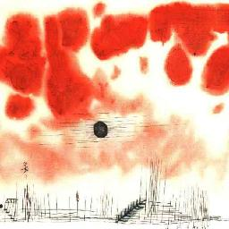
  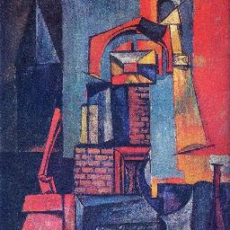
  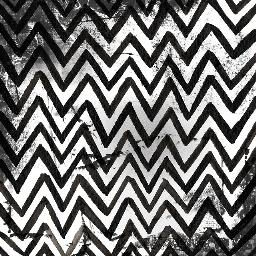
  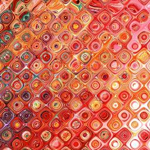
  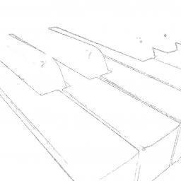
  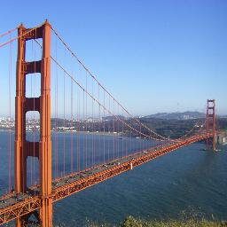
  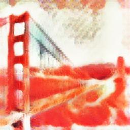
  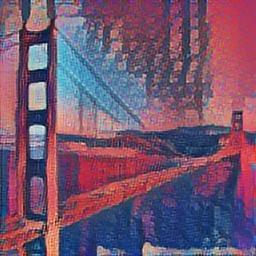
  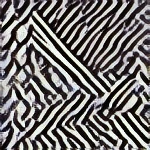
  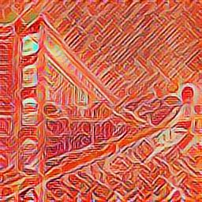
  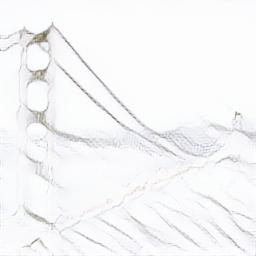
  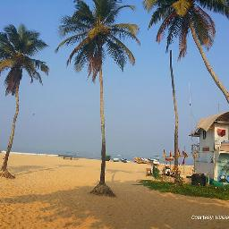
  
  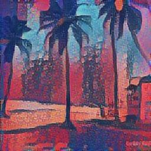
  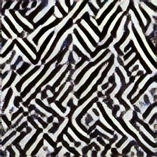
  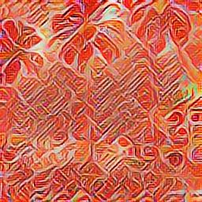
  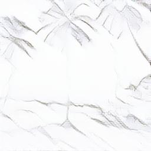
</p>

In order to stylize an image using the "identity interpolation" technique (see
Figure 8 in paper), run the following command where $INTERPOLATION_WEIGHTS
represents the desired weights for interpolation.

```bash
# To use images in style_images and content_images directories.
$ cd /path/to/arbitrary_image_stylization
# Note that 0.0 corresponds to an identity interpolation where as 1.0
# corresponds to a fully stylized photograph.
$ INTERPOLATION_WEIGHTS='[0.0,0.2,0.4,0.6,0.8,1.0]'
$ arbitrary_image_stylization_with_weights \
  --checkpoint=/path/to/arbitrary_style_transfer/model.ckpt \
  --output_dir=/path/to/output_dir \
  --style_images_paths=images/style_images/*.jpg \
  --content_images_paths=images/content_images/statue_of_liberty_sq.jpg \
  --image_size=256 \
  --content_square_crop=False \
  --style_image_size=256 \
  --style_square_crop=False \
  --interpolation_weights=$INTERPOLATION_WEIGHTS \
  --logtostderr
```

#### Example results

<table cellspacing="0" cellpadding="0" border-spacing="0" style="border-collapse: collapse; border: none;" >
<tr style="border-collapse:collapse; border:none;">
<th width="12.5%">content image</th> <th width="12.5%">w=0.0</th> <th width="12.5%">w=0.2</th> <th width="12.5%">w=0.4</th>
<th width="12.5%">w=0.6</th> <th width="12.5%">w=0.8</th> <th width="12.5%">w=1.0</th> <th width="12.5%">style image</th>
</tr>
<tr style="border-collapse:collapse; border:none;">
<th>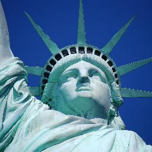</th>
<th>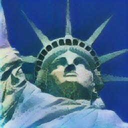</th>
<th>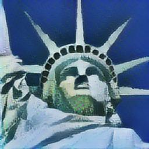</th>
<th></th>
<th>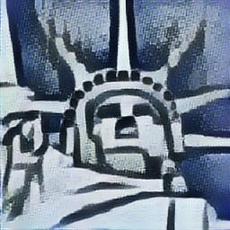</th>
<th>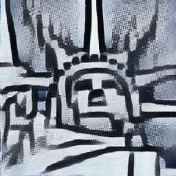</th>
<th>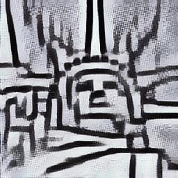</th>
<th>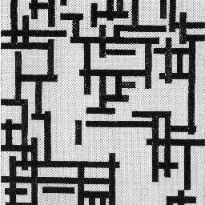</th>
</tr>
<tr style="border-collapse:collapse; border:none;">
<th></th>
<th>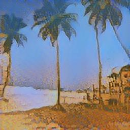</th>
<th>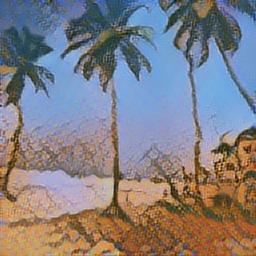</th>
<th>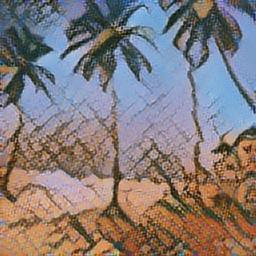</th>
<th>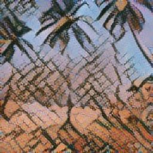</th>
<th>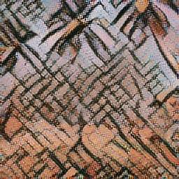</th>
<th>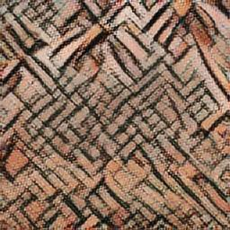</th>
<th>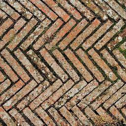</th>
</tr>
</table>

# Training a Model

## Set Up
To train your own model, you need to have the following:

1. A directory of images to use as styles. We used [Painter by Number dataset
   (PBN)](https://www.kaggle.com/c/painter-by-numbers) and
   [Describable Textures Dataset (DTD)](https://www.robots.ox.ac.uk/~vgg/data/dtd/).
   [PBN training](https://github.com/zo7/painter-by-numbers/releases/download/data-v1.0/train.tgz)
   [PBN testing](https://github.com/zo7/painter-by-numbers/releases/download/data-v1.0/test.tgz)
   [DTD dataset](https://www.robots.ox.ac.uk/~vgg/data/dtd/download/dtd-r1.0.1.tar.gz)
2. The ImageNet dataset. Instructions for downloading the dataset can be found
   [here](https://github.com/tensorflow/models/tree/master/research/inception#getting-started).
3. A [trained VGG model checkpoint](http://download.tensorflow.org/models/vgg_16_2016_08_28.tar.gz).
4. A [trained Inception-v3 model
   checkpoint](http://download.tensorflow.org/models/inception_v3_2016_08_28.tar.gz).
5. Make sure that you have checkout the slim
   [slim](https://github.com/tensorflow/tensorflow/blob/e062447136faa0a3513e3b0690598fee5c16a5db/tensorflow/contrib/slim/README.md)
   repository.

## Create Style Dataset

A first step is to prepare the style images and create a TFRecord file.
To train and evaluate the model on different set of style images, you need
to prepare different TFRecord for each of them. Eg. use the PBN and DTD
training images to create the training dataset and use a subset of PBN
and DTD testing images for testing dataset.

The following command may be used to download DTD images and create a TFRecord
file from images in cobweb category.

```bash
$ cd /path/to/dataset
$ path=$(pwd)
$ wget https://www.robots.ox.ac.uk/~vgg/data/dtd/download/dtd-r1.0.1.tar.gz
$ tar -xvzf dtd-r1.0.1.tar.gz
$ STYLE_IMAGES_PATHS="$path"/dtd/images/cobwebbed/*.jpg
$ RECORDIO_PATH="$path"/dtd_cobwebbed.tfrecord

$ image_stylization_create_dataset \
    --style_files=$STYLE_IMAGES_PATHS \
    --output_file=$RECORDIO_PATH \
    --compute_gram_matrices=False \
    --logtostderr
```

## Train a Model on a Small Dataset

Then, to train a model on dtd_cobwebbed.tfrecord without data augmentation
use the following command.

```bash
logdir=/path/to/logdir
$ arbitrary_image_stylization_train \
      --batch_size=8 \
      --imagenet_data_dir=/path/to/imagenet-2012-tfrecord \
      --vgg_checkpoint=/path/to/vgg-checkpoint \
      --inception_v3_checkpoint=/path/to/inception-v3-checkpoint \
      --style_dataset_file=$RECORDIO_PATH \
      --train_dir="$logdir"/train_dir \
      --content_weights={\"vgg_16/conv3\":2.0} \
      --random_style_image_size=False \
      --augment_style_images=False \
      --center_crop=True \
      --logtostderr
```
To see the progress of training, run TensorBoard on the resulting log directory:

```bash
$ tensorboard --logdir="$logdir"
```

Since dtd_cobwebbed.tfrecord contains only 120
images, training takes only a few hours and it's a good test
to make sure everything work well.
Example of stylization results over a few training
style images (on style images cobwebbed_0129.jpg,
cobwebbed_0116.jpg, cobwebbed_0053.jpg, cobwebbed_0057.jpg,
cobwebbed_0044.jpg from DTD dataset):

<p align='center'>
  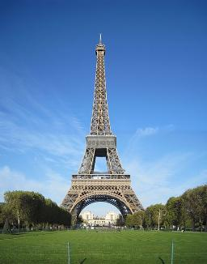
  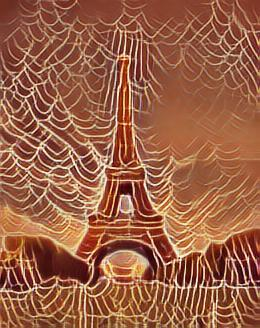
  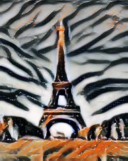
  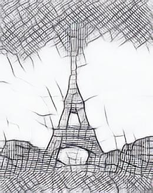
  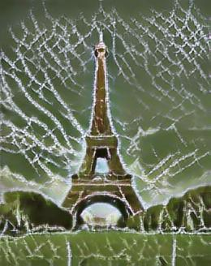
  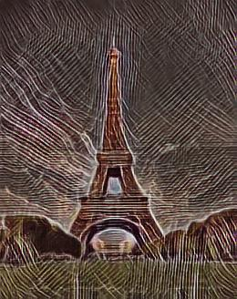
</p>

## Train a Model on a Large Dataset With Data Augmentation

To train a model with a good generalization over unobserved style images, you
need to train the model on a large training dataset (see Figure 5
[here](https://arxiv.org/abs/1705.06830)).
We trained our model on PBN and DTD training images with data augmentation
over style images for about 3M steps using 8 GPUS. You may train the model
on 1 GPU, however this will take roughly 8 times as long.

To train a model with data augmentation over style images use the following
command.

```bash
logdir=/path/to/logdir
$ arbitrary_image_stylization_train \
      --batch_size=8 \
      --imagenet_data_dir=/path/to/imagenet-2012-tfrecord \
      --vgg_checkpoint=/path/to/vgg-checkpoint \
      --inception_v3_checkpoint=/path/to/inception-v3-checkpoint \
      --style_dataset_file=/path/to/style_images.tfrecord \
      --train_dir="$logdir"/train_dir \
      --random_style_image_size=True \
      --augment_style_images=True \
      --center_crop=False \
      --logtostderr
```

## Run an evaluation job

To run an evaluation job on test style images use the following command.

Note that if you are running the training job on a GPU, then you can
run a separate evaluation job on the CPU by setting CUDA_VISIBLE_DEVICES=' ':

```bash
$ CUDA_VISIBLE_DEVICES= arbitrary_image_stylization_evaluate \
      --batch_size=16 \
      --imagenet_data_dir=/path/to/imagenet-2012-tfrecord \
      --eval_style_dataset_file=/path/to/evaluation_style_images.tfrecord \
      --checkpoint_dir="$logdir"/train_dir \
      --eval_dir="$logdir"/eval_dir \
      --logtostderr
```

## Distill style prediction network using MobileNetV2

To distill the InceptionV3 style prediction network using a MobileNetV2 model,
you will need the MobilenetV2 pre-trained checkpoint from
https://storage.googleapis.com/mobilenet_v2/checkpoints/mobilenet_v2_1.0_224.tgz
and the checkpoint from a trained arbitrary image stylization model
(You can use [this](https://storage.googleapis.com/download.magenta.tensorflow.org/models/arbitrary_style_transfer.tar.gz)).

You will also need to [install the TF-slim image models library](https://github.com/tensorflow/models/tree/master/research/slim#installing-the-tf-slim-image-models-library).
Unfortunately, there is currently no way to do this other than cloning the
repository and adding the module to your `$PYTHONPATH`.

For best results, use the same datasets used to train the original
arbitrary image stylization model (If using the pre-trained model available here,
use ImageNet for the content images dataset and a combination of PBN and DTD for
the style images dataset).

```bash
$ arbitrary_image_stylization_distill_mobilenet \
      --imagenet_data_dir=/path/to/imagenet-2012-tfrecord \
      --style_dataset_file=/path/to/style_images.tfrecord \
      --train_dir=/path/to/logdir \
      --mobilenet_checkpoint=/path/to/mobilenet_v2_1.0_224/checkpoint//mobilenet_v2_1.0_224.ckpt \
      --initial_checkpoint=/path/to/arbitrary_style_transfer/checkpoint/model.ckpt \
      --use_true_loss=False
```

## Train a Model on a Large Dataset With Data Augmentation to run on mobile

You can train a mobile version of the Model to run on mobile phone using TensorFlow Lite.
To train the model, you will need the MobilenetV2 pre-trained checkpoint and
install TF-slim model library as described in previous section.

To train the mobile Model use the following command.

```bash
logdir=/path/to/logdir
$ arbitrary_image_stylization_train_mobile \
      --batch_size=8 \
      --imagenet_data_dir=/path/to/imagenet-2012-tfrecord \
      --vgg_checkpoint=/path/to/vgg-checkpoint \
      --mobilenet_checkpoint=/path/to/mobilenet_v2_1.0_224/checkpoint//mobilenet_v2_1.0_224.ckpt \
      --style_dataset_file=/path/to/style_images.tfrecord \
      --train_dir="$logdir"/train_dir \
      --random_style_image_size=True \
      --augment_style_images=True \
      --center_crop=False \
      --logtostderr
```

To convert the trained Model to TensorFlow Lite format, use the following command/

```bash
logdir=/path/to/logdir
$ arbitrary_image_stylization_convert_tflite \
      --checkpoint="$logdir"/train_dir \
      --imagenet_data_dir=/path/to/imagenet-2012-tfrecord \
      --style_dataset_file=/path/to/style_images.tfrecord \
      --output_dir="$logdir"/tflite \
      --logtostderr
```

In the output folder, there are 6 TensorFlow Lite models:

1. `style_predict.tflite:` The float32 version of style prediction network
1. `style_predict_quantized.tflite`: The int8 weight-quantized version of style prediction network
1. `style_predict_calibrated.tflite`: The full int8-quantized version of style prediction network
1. `style_transform.tflite`: The float32 version of style transformation network
1. `style_transform_quantized.tflite`: The int8 weight-quantized version of style transformation network
1. `style_transform_calibrated.tflite`: The full int8-quantized version of style transformation network
