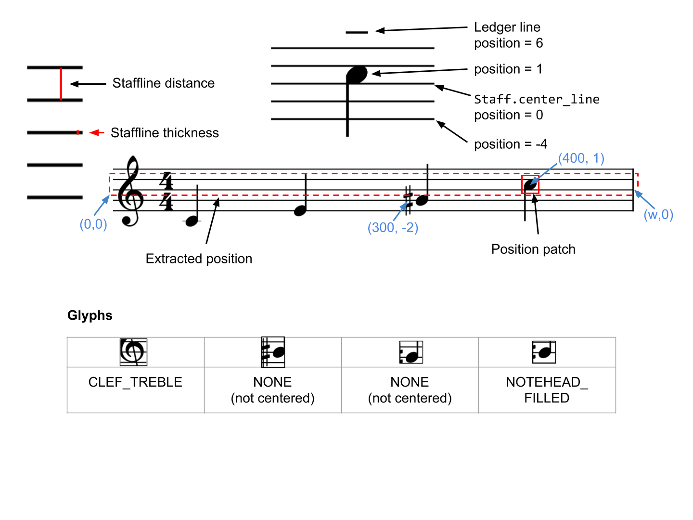

# Magenta OMR Concepts

## Diagram

## Glossary

| Term         | Definition                                                    |
| ------------ | ------------------------------------------------------------- |
| barline      | A vertical line spanning one or more staves, which is not a   |
:              : stem.                                                         :
| beam         | A thick line connecting multiple stems horizontally. Each     |
:              : beam halves the duration of a filled notehead connected to    :
:              : the stem, which would otherwise be a quarter note.            :
| notehead     | An ellipse representing a single note. May be filled (quarter |
:              : or lesser value) or empty (half or whole note).               :
| ledger line  | An extra line above or below the 5 staff lines.               |
| staff        | The object which notes and other glyphs are placed on.        |
| staff system | One or more staves joined by at least one barline.            |
| staves       | Plural of staff.                                              |
| stem         | A vertical line attached to a notehead. All noteheads except  |
:              : for whole notes should have a stem.                           :

## Staves

Staves have 5 parallel, horizontal lines, and are parameterized by the center
(3rd) line, and the staffline distance (vertical distance between consecutive
staff lines). The staffline distance is constant for reasonable quality printed
music scores, and this representation avoids redundancy and makes it possible to
find the coordinates of each staff line.

## Staff Positions

Glyphs are vertically centered either on staff lines (or ledger lines), or on
the space halfway between lines. We refer to each of these y coordinates as a
*position*.

**Note**: We still refer to positions as *stafflines* in many places which is
counter-intuitive, since positions are also on the space between lines, and can
be a potential ledger line which is empty in a particular image. We are in the
process of renaming stafflines in this context to staff positions.

*   Staff position 0 is the third staff line (staff center line), which is also
    the y-coordinate that is outputted by staff detection.
*   Staff positions are half the staffline distance apart. Always calculate the
    relative y position by <code>tf.floordiv(staffline_distance * y_position,
    2)</code> instead of dividing by 2 first.
*   In treble clef, staff position 0 is B4, -6 is C4, -1 is A4, and +1 is C5.
*   In bass clef, staff position 0 is D3, +3 is G3, and +6 is C4.

## Glyphs in Magenta OMR

Glyphs are defined in
[<code>musicscore.proto</code>](../protobuf/musicscore.proto).
Each glyph has an x coordinate on the original image, and a y position (staff
position). The staff position determines the pitch of the glyph, if applicable.
If the glyph is especially large (e.g. clefs) or is not centered on a particular
vertical position, we choose a *canonical* staff position (e.g. the G line for
treble clef, aka G clef).

### Glyph centers

*   Every glyph needs a canonical center coordinate. The classifier will detect
    the glyph if the window (e.g. convolutional filter) is centered on this
    point.
*   Noteheads are centered on the middle of the ellipsis, which should be
    exactly on a staffline or halfway between stafflines.
*   Accidentals should be centered on their center of mass. For flats, sharps,
    and naturals, this is the center of the empty space inside them. For double
    sharps, this is the middle of the crosshairs.
*   Treble clef ('G clef") is centered on the intersection of the thin vertical
    line with the G staffline (staff position -2).
*   Bass clef ("F clef") is centered on the F staffline (staff position +2). The
    x coordinate is halfway between the filled circle on the left and the
    vertical segment on the right.
*   All rests should normally be centered at staff position 0, unless shifted
    from their usual position.
