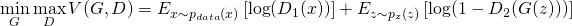
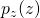
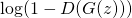

# Generative Adversarial Networks

In this post, we’re going to describe Generative Adversarial Networks (GAN),
a framework for generating realistic samples from random noise first introducedby Goodfellow et al in 2014.
At a high level, a GAN works by staging a battle between two neural networks.
The first one generates samples.
In parallel, the second tries to discriminate those samples from the dataset’s actual samples.

We’ll first describe why we would want to do this and give some intuition behind what inspired GANs.
We’ll then describe how they work, detail some disadvantages, and close with recent and future directions. 

   
  <i>Here are a set of faces generated purely from random noise.</i> 
  <i>Source: http://torch.ch/blog/2015/11/13/gan.html.</i>

So far deep generative models have had much less success than deep discriminative models.
This is partly due to difficulty in approximating intractable probabilistic posteriors that arise in their optimization
algorithms, which forces practitioners to use techniques like MCMC.
It’s also because many of the methods that help train discriminative models do not work as well when applied
to generative models. The adversarial framework in this paper can be trained purely with back propagation and helps
solve some of these problems.

GANs are an idea rooted in Game Theory.
Two models compete against each other.
The first, the Generator, generates examples that it thinks are real.
The second, the Discriminator, tries to discriminate between examples from the dataset and examples drawn from
the pool generated by the Generator.
The Discriminator is trained in a supervised manner with two labels -- real or generated.
The Generator is trained to maximize the Discriminator’s error on generated examples.
The results is that it learns how to generate examples that approximate the real data distribution.
Ideally, the game continues until the optimization procedure finds a Nash equilibrium.

Unfortunately, finding a Nash equilibrium for high dimensional non-convex minimax optimization games is currently
considered to be an intractable problem.
With GANs, we approximate it by optimizing an adversarial loss:

   

The loss has two components.
The first one makes the Discriminator better at discriminating real examples from fake ones, and the second one makes
the Generator generate samples that the discriminator considers real.
The input, , is an input noise vector with distribution .
This is usually an N-dimensional normal or uniform distribution and serves as input to the network.

Both parts can be independently optimized with gradient based optimization in turns.
First, do an optimization step for the Discriminator to maximize , then do an optimization
step for the Generator to make it better at fooling this new Discriminator by minimizing .
If  is very low, which is the case early in training, 
is very close to zero and the generator doesn’t learn much.
This can be fixed by maximizing  instead, which converges to the same solution,
but provides strong gradients when  is low.

Under certain conditions, this process converges to a fixed point, where the Generator has learned the true data
distribution, and hence the Discriminator cannot classify real examples from generated ones.
In practice, the original paper’s model is capable of generating great results on simple tasks such as MNIST.
Recent advances have made it possible to get higher quality more complicated problems like generating faces and CIFAR images.

  

## Disadvantages
GANs are difficult to optimize.
The two networks have to be kept “in sync”.
If the Discriminator wins by too big a margin, then the Generator can’t learn as the Discriminator error is too small.
However, if the Generator wins by too much, it will have trouble learning from because Discriminator is too weak to teach it.

A degenerate case is when the Generator collapses and produces a single example, which is badly classified by
the Discriminator.
This is a deep problem, because it shows that in practice, the Generator doesn’t necessarily converge to the
data distribution.

Solving these problems is a topic of further research, but there already are some new techniques for training GANs
that mitigate these negative effects.
Here are a few:

  - Make the Discriminator much less expressive by using a smaller model.
  Generation is a much harder task and requires more parameters, so the Generator should be significantly bigger.
  - Use dropout in the Discriminator, which makes it less prone to mistakes the Generator can exploit instead of
  learning the data distribution.
  - Use adaptive L2 regularization on the Discriminator.
  By increasing the L2 regularization coefficient, the Discriminator becomes weaker.
  It’s a good idea to do this when the Discriminator is very strong and then decrease it again when the Generator
  has caught up.

Related work
------------

- [LAPGAN](http://arxiv.org/pdf/1506.05751v1.pdf), generating images using Laplacian pyramid.
- [RCGAN](http://arxiv.org/pdf/1602.05110v2.pdf), generating images as a sum of layers with an RNN.
- [Conditional GANs](https://arxiv.org/pdf/1411.1784v1.pdf), which generate examples conditioned on labels.
- [InfoGAN](https://arxiv.org/pdf/1606.03657v1.pdf), using meaningful input noise instead of just a source of randomness.
- [Improved Techniques for Training GANs](https://arxiv.org/pdf/1606.03498v1.pdf).
- [BiGAN](https://arxiv.org/pdf/1605.09782v1.pdf), with a way to project from the example space back to the latent space.
- [Adversarial autoencoders](http://arxiv.org/pdf/1511.05644v2.pdf), VAE, which uses adversarial loss to compare latent
space of a VAE to some prior distribution.

