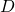
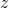
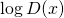
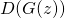
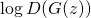
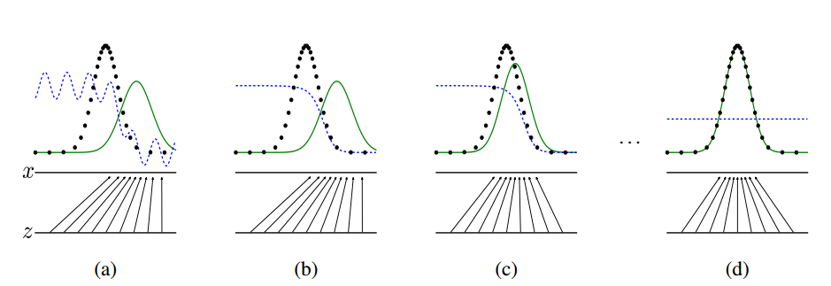
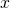
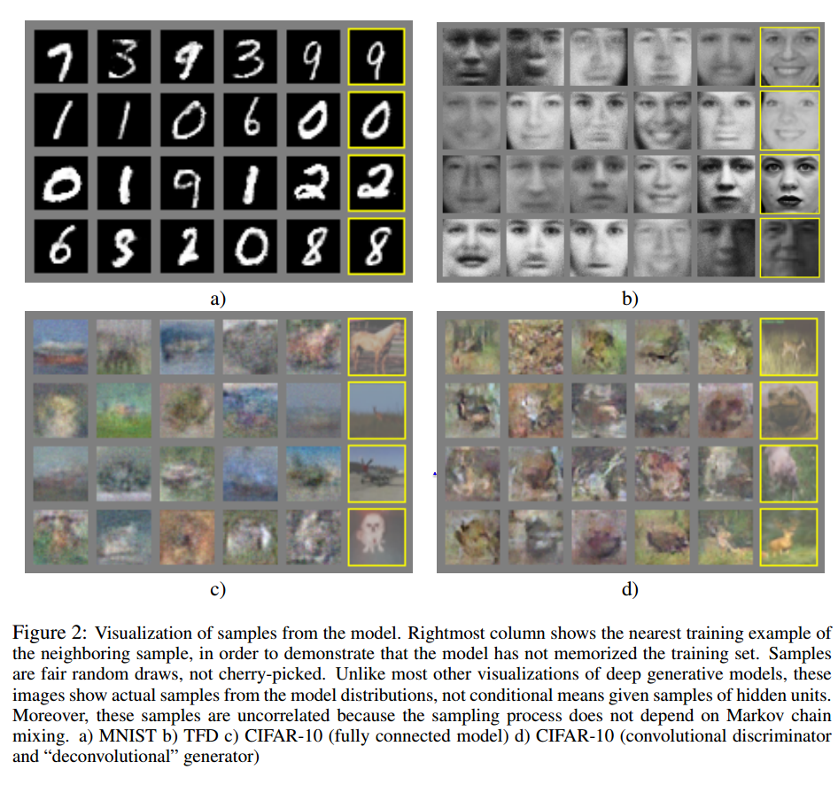

# Generative Adversarial Networks

(Review by [Max Strakhov](https://github.com/monnoroch), with images taken from the paper)

Generative Adversarial Networks (GAN) is a framework for generating realistic samples from random noise first
introduced by Goodfellow et al in 2014. At a high level, a GAN works by staging a battle between two neural networks.
The first one generates samples. In parallel, the second network tries to discriminate those samples from samples from
the real data.
We’ll first describe why we would want to do this and give some intuition behind what inspired GANs.
We’ll then describe how they work, detail some disadvantages, and close with recent and future directions.

   
  <i>Here are a set of faces generated purely from random noise.</i> 
  <i>Source: http://torch.ch/blog/2015/11/13/gan.html.</i>

So far deep generative models have had much less success than deep discriminative models.
This is partly due to difficulty in approximating intractable probabilistic posteriors that arise in their
optimization algorithms, which forces practitioners to use techniques like
[Markov Chain Monte Carlo](https://en.wikipedia.org/wiki/Markov_chain_Monte_Carlo).
It’s also because many of the methods that help train discriminative models do not work as well when applied to
generative models.
The adversarial framework in this paper can be trained purely with back propagation and helps solve some of
these problems.

GANs are an idea rooted in Game Theory.
Two models compete against each other.
The first, the generator, generates examples that it thinks are real.
The second, the discriminator, tries to discriminate between examples from the dataset and examples drawn
from the pool generated by the generator.
The discriminator is trained in a supervised manner with two labels - Real and Generated.
The generator is trained to maximize the discriminator’s error on generated examples
and consequently learns how to generate examples that approximate the real data distribution.
Overall, we are optimizing the adversarial loss,

   

Those familiar with game theory might appreciate the insight that the optimization of this objective is like finding
a Nash equilibrium of a minimax game between the generator and the discriminator.
The loss has two components.
The first one, , makes the discriminator  better at
discriminating real examples from fake ones, and the second one, , makes the generator
 generate samples that the discriminator considers real.
The input, , is a noise vector with distribution .
This is usually an N-dimensional normal or uniform distribution and serves as input to the network.

Both parts can be independently optimized with gradient based methods.
First, do an optimization step for the discriminator to maximize , then do
an optimization step for the generator to make it better at fooling this new discriminator by minimizing
.
If  is very low, which is the case early in training,
 is very close to zero and the generator cannot learn quickly.
This can be fixed by maximizing  instead, which converges to the same solution, but
provides strong gradients when  is low.

Here’s a visual explanation of how the learning happens.

  
 <i>Training a GAN to fit a data distribution.</i>

Imagine that the real data is represented by some distribution, drawn as a dotted black line on the figure.
Real examples then are obtained by sampling from it.
The domain of the model's input is .
Fake examples are obtained by sampling from some distribution on domain .
The generator maps this  to , which results in fake examples
that are distributed according to the green line on the figure.
The dashed blue line represents the discriminator, which gives each example from  a probability
of being from the real data distribution.

The generator and the discriminator are each initialized randomly (see Figure (a)), and then we train the discriminator to
distinguish real examples from fake examples produced by the generator (see Figure (b)).
Once trained, we fix the discriminator and train the generator to maximize the discriminator’s error (Figure (c)).
Then we train the discriminator again, and so forth, until convergence.
At this point, the generator has learned a true data distribution which matches the black dotted line exactly.
Therefore the discriminator has no way of telling whether an example is real or fake, so it consistently returns ½ (Figure (d)).

Under certain conditions, this process reaches a fixed point where the generator has learned the true
data distribution, and hence the discriminator cannot classify real examples from generated ones.
The original paper’s model is capable of generating great results on simple tasks such as MNIST.
Recent advances have made it possible to get high quality examples on more complicated problems, like generating faces and CIFAR
images.

## Experiments.

  

To evaluate model performance quantitatively, it is possible to calculate the likelihood of the real examples that the model induces.
Given the distribution induced by a trained GAN, real data from the MNIST dataset has an approximated log likelihood of 225
(with standard error of 2).
In the same setting, a Deep Belief Network (DBN) gives an approximated log likelihood of 138 with a similar standard error.
On the Toronto Face Dataset, which is a much harder problem, GANs can achieve a log likelihood of 2057 ± 26 on selected real examples.
In contrast, the best DBN results are 1909 ± 66.

## Disadvantages
GANs are difficult to optimize.
The two networks have to be kept in sync.
If the discriminator wins by too big a margin, then the generator can’t learn as the discriminator error is too small.
However, if the generator wins by too much, it will have trouble learning because the discriminator is too weak
to teach it.
A degenerate case is when the generator collapses and produces a single example, which is badly classified by
the discriminator.
This is a deep problem, because it shows that in practice the generator doesn’t necessarily converge to the
data distribution.
Solving these problems is a topic of further research, but there already are some new techniques for training GANs
that mitigate these negative effects.
Here are a few:

  - Make the discriminator much less expressive by using a smaller model.
  Generation is a much harder task and requires more parameters, so the generator should be significantly bigger.
  - Use dropout in the discriminator, which makes it less prone to mistakes the generator can exploit instead of learning
  the data distribution.
  - Use adaptive L2 regularization on the discriminator.
  By increasing the L2 regularization coefficient, the discriminator becomes weaker.
  It’s a good idea to do this when the discriminator is very strong and then decrease it again when the generator has
  caught up.

Related work
------------

- [LAPGAN](http://arxiv.org/pdf/1506.05751v1.pdf), generating images using Laplacian pyramid.
- [RCGAN](http://arxiv.org/pdf/1602.05110v2.pdf), generating images as a sum of layers with an RNN.
- [Conditional GANs](https://arxiv.org/pdf/1411.1784v1.pdf), which generate examples conditioned on labels.
- [InfoGAN](https://arxiv.org/pdf/1606.03657v1.pdf), using meaningful input noise instead of just a source of randomness.
- [Improved Techniques for Training GANs](https://arxiv.org/pdf/1606.03498v1.pdf).
- [BiGAN](https://arxiv.org/pdf/1605.09782v1.pdf), with a way to project from the example space back to the latent space.
- [Adversarial autoencoders](http://arxiv.org/pdf/1511.05644v2.pdf), VAE, which uses adversarial loss to compare latent
space of a VAE to some prior distribution.
