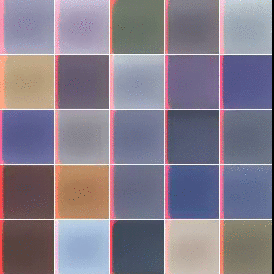

DRAW: A Recurrent Neural Network for Image Generation
=====================================================
(Review by [Tim Cooijmans](https://github.com/cooijmanstim), with images taken from the paper)

Introduction
------------

In [DRAW: A Recurrent Neural Network for Image Generation][draw], Gregor et al. propose a neural network that generates images by drawing onto a canvas. It has two advantages over previous generative models:
  1. The iterative nature of the process allows the model to start with a rough sketch and then gradually refine it.
  2. The interactions with the canvas are localized, enabling the model to focus on parts of a scene rather than having to generate a whole scene at once.

The image on the right (courtesy of Ivo Danihelka) shows the process of generating novel [Street View House Number][svhn] images.

Model Description
-----------------

The DRAW model consists of two interleaved RNNs; an encoder and a decoder. Together they take the form of a recurrent [VAE][vae], exchanging a latent code at each time step.

![Model Diagram][diagram]

At each time step, the encoder RNN takes the previous encoder and decoder states along with information read from the input image *x* and computes a distribution *Q(z|x)* over latent codes *z*.  Concretely, this typically comes in the form of a pair of mean and variance vectors that parameterize a diagonal Gaussian. We sample a latent vector *z* from this distribution and pass it to the decoder, which writes to the canvas. The interactions with the input image and output canvas typically occur through an attention mechanism explained below.

This procedure is repeated a fixed number of times, after which the final state of the canvas is used to determine a probability distribution *P(x|z)*. For the grayscale [MNIST][mnist] dataset of handwritten digits, the canvas maps to a matrix of independent Bernoulli probabilities through the logistic sigmoid function.

![Generating MNIST][mnist generation] ![Generating SVHN][svhn generation]

The training loss consists of two terms. The first is a sum of KL divergences from a chosen prior *P(z)* to the *Q(z|x)* distributions, and the second is the log likelihood of the input image under the distribution *P(x|z)*.

To generate images from a trained DRAW model, we sample each latent vector z not from consecutive *Q(z|x)* distributions but from the prior *P(z)*. The encoder is not involved in generation.

Note that in practice one does not sample from the final visible distribution *P(x|z)*, but rather takes the mean or mode. This is because the distribution typically models pixels as independent, when in fact images carry a lot of spatial structure. For one thing, neighboring pixels are strongly correlated. Sampling pixels independently would not yield nice images.

Attention
---------

Reading from the input image and writing to the output canvas occurs through a visual attention mechanism to confine the scope of each interaction. This makes it easier for the model to focus and make local changes.

Visual attention was first explored by [Schmidhuber & Huber][attention schmidhuber] in 1990 and has seen much recent interest. It has found use in [tracking][attention tracking], [viewpoint-invariant generative models][attention generation], [image classification][attention classification] and [multiple object recognition][attention recognition]. However unlike previous approaches, the foveation model introduced as part of DRAW is differentiable and so can be trained end to end with backpropagation. Instead of simply cropping a patch from the input image, DRAW extracts the pixels in the patch by Gaussian interpolation.

![Attention Parameterization][attention parameterization] ![Attention Interpolation][attention interpolation]

A uniform grid of Gaussian filters is imposed on the image, each filter corresponding to a pixel in the extracted patch. Each patch pixel’s value is computed by taking a linear combination of the image pixels with weights given by the corresponding filter. The grid of filters is controlled by neural networks that map the decoder hidden state to variables that determine the location and zoom level of the attended area.

The process for writing to the output canvas is similar but transposed: the model generates a patch and the attention mechanism projects the patch onto the image. Previously each patch pixel was a linear combination of all image pixels; now each image pixel is a linear combination of all patch pixels.

Related work
------------

- [Variational Auto-Encoders][vae], the autoencoder architecture upon which DRAW is based.
- [Spatial Transformer Networks][stn] introduced a similar but more general and computationally efficient foveation model that allows arbitrary affine transformations.
- [AlignDRAW][aligndraw] is an adaptation of DRAW that is conditioned on image captions. After training this model on a large set of image and caption pairs, it can be used to generate images from captions.

[draw]: https://arxiv.org/abs/1502.04623
[vae]: https://arxiv.org/abs/1312.6114
[diagram]: assets/diagram.png
[mnist]: https://www.tensorflow.org/tutorials/mnist/tf/index.html
[svhn]: http://ufldl.stanford.edu/housenumbers/
[mnist generation]: assets/mnist_generation.png
[svhn generation]: assets/svhn_generation.png
[attention schmidhuber]: http://people.idsia.ch/~juergen/attentive.html
[attention tracking]: http://arxiv.org/abs/1109.3737
[attention generation]: https://arxiv.org/abs/1312.6110
[attention classification]: http://arxiv.org/abs/1406.6247
[attention recognition]: https://arxiv.org/abs/1412.7755
[attention parameterization]: assets/attention_parameterization.png
[attention interpolation]: assets/attention_interpolation.png
[stn]: https://arxiv.org/abs/1506.02025
[aligndraw]: http://arxiv.org/abs/1511.02793
