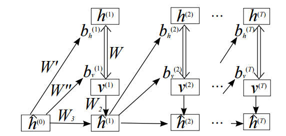
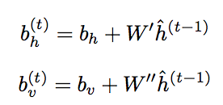
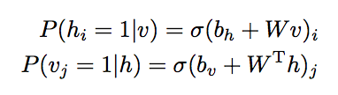
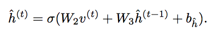
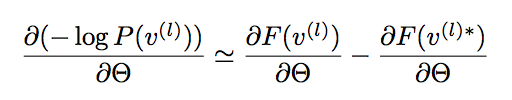
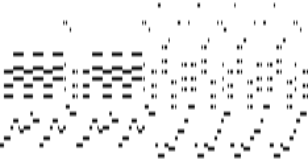
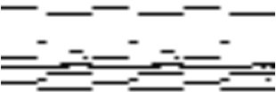
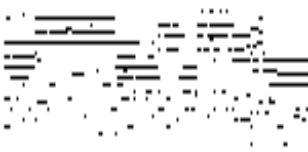
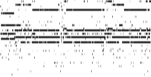

----
## Modeling Temporal Dependencies in High-Dimensional Sequences: Application to Polyphonic Music Generation and Transcription
(Review by [Dan Shiebler](https://github.com/dshieble). You can find a TensorFlow implementation [here.](https://github.com/dshieble/Music_RNN_RBM))

[This paper](http://www-etud.iro.umontreal.ca/~boulanni/ICML2012.pdf), by Boulanger-Lewandowski et al, was an influential work that served as a bridge between research on energy based models in the 2000s and early 2010s and more modern research on recurrent neural networks. The algorithms introduced here are some of the most successful polyphonic music generation algorithms to date. In addition, the paper laid the groundwork for future research in sequential generative models, such as [Graves 2013](http://arxiv.org/pdf/1308.0850v5.pdf).

The authors of [Boulanger-Lewandowski 2012](http://www-etud.iro.umontreal.ca/~boulanni/ICML2012.pdf) describe a series of powerful sequential generative models, including the Recurrent Neural Network - Restricted Boltzmann Machine (RNN-RBM). We can think of this powerful model as a sequence of Restricted Boltzmann Machines (RBM) whose parameters are determined by a Recurrent Neural Network (RNN). Each RBM in the sequence is capable of modeling a complex and high dimensional probability distribution, and the RNN conditions each distribution on those of the previous time steps.

Like the RBM, the RNN-RBM is an unsupervised generative model. This means that the objective of the algorithm is to directly model the probability distribution of an unlabeled data set, such as a set of videos or music.

### Architecture
The architecture of the RNN-RBM is not tremendously complicated. Each RNN hidden unit is paired with an RBM. The RNN hidden unit h(t) takes input from observation vector v(t) as well as from hidden unit h(t-1). The outputs of hidden unit h(t) are the parameters of RBM(t+1), which takes as input observation vector v(t+1).

Just like in any sequential model with hidden units, the value of hidden unit h(t) encodes information about the state of the sequence at time t. In the case of music, this could be information about the chord being played or the mood of the song.

All of the RBMs share the same weight matrix, and only the hidden and visible bias vectors are determined by the outputs of the RNN hidden units. The role of the RBM weight matrix is to specify a consistent prior on all of the RBM distributions, and the role of the bias vectors is to communicate temporal information.

### Generation
To generate a sequence with the RNN-RBM, we prime the RNN and repeat the following procedure:

- Use the RNN-to-RBM weight and bias matrices and the state of RNN hidden unit h(t-1) to determine the bias vectors for RBM(t).

    
- Perform [Gibbs Sampling](http://stats.stackexchange.com/questions/10213/can-someone-explain-gibbs-sampling-in-very-simple-words) to sample from RBM(t) and generate v(t).

    
- Use v(t), the state of RNN hidden unit h(t-1), and the weight and bias matrices of the RNN to determine the state of RNN hidden unit h(t).

    

### Cost Function

The cost function for the RNN-RBM is the [contrastive divergence](http://www.robots.ox.ac.uk/~ojw/files/NotesOnCD.pdf) estimation of the negative log likelihood of the observation vector v(t), as computed from RBM(t). In practice we calculate this by:

-  Performing Gibbs sampling to sample output(t), written as v(t)*, from RBM(t).
-  Taking the difference between the free energies of v(t) and v(t)*.

Then the gradient of the loss is:

### Music

The authors use the RNN-RBM to generate [polyphonic](https://en.wikipedia.org/wiki/Polyphony) music. In their representation, the inputs to the RNN and the outputs of the RBM are lines in a [midi](https://en.wikipedia.org/wiki/MIDI) piano roll.

Below are piano rolls of a song from the Nottingham database and a portion of the song "Fix You" by Coldplay.
 
 

 

 
 
On the other hand, here are some examples of midi piano rolls created by an RNN-RBM. You can also find mp3 files of some of the music that the authors generated [here.](http://www-etud.iro.umontreal.ca/~boulanni/icml2012)

 

 

 

### Extensions
The basic RNN-RBM can generate music that sounds nice, but it struggles to produce anything with temporal structure beyond a few chords. This motivates some extensions to the model to better capture temporal dependencies. For example, the authors implement [Hessian-Free optimization](http://www.icml-2011.org/papers/532_icmlpaper.pdf), an algorithm for efficiently performing 2nd order optimization. Another tool that is very useful for representing long term dependencies is the [LSTM](http://colah.github.io/posts/2015-08-Understanding-LSTMs/) cell. It's reasonable to suspect that converting the RNN cells to LSTM cells would improve the model's ability to represent longer term patterns in the song or sequence, such as in [this paper](http://www.ijcai.org/Proceedings/15/Papers/582.pdf) by Lyu et al.

Another way to increase the modelling power of the algorithm is to replace the RBM with a different model. The authors of [Boulanger-Lewandowski 2012](http://www-etud.iro.umontreal.ca/~boulanni/ICML2012.pdf) replace the RBM with a neural autoregressive distribution estimator ([NADE](http://homepages.inf.ed.ac.uk/imurray2/pub/11nade/nade.pdf)), which is a similar algorithm that models the data with a tractable distribution. Since the NADE is tractable, it doesn't suffer from the gradient-approximation errors that contrastive divergence introduces. You can see [here](http://www-etud.iro.umontreal.ca/~boulanni/icml2012) that the music generated by the RNN-NADE shows more local structure than the music generated by the RNN-RBM.

We can also replace the RBM with a [Deep Belief Network](https://www.cs.toronto.edu/~hinton/nipstutorial/nipstut3.pdf), which is an unsupervised neural network architecture formed from multiple RBMs stacked on top of one another. Unlike RBMs, DBNs can take advantage of their multiple layers to form hierarchical representations of data. In this later [paper](http://www.academia.edu/16196335/Modeling_Temporal_Dependencies_in_Data_Using_a_DBN-LSTM) from Vohra et al, the authors combine DBNs and LSTMs to model high dimensional temporal sequences and generate music that shows more complexity than the music generated by an RNN-RBM.
