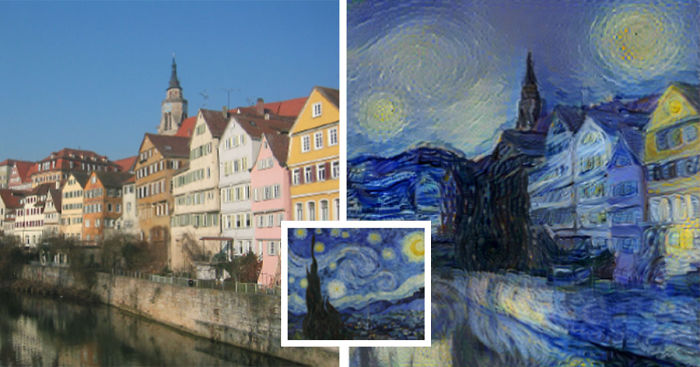
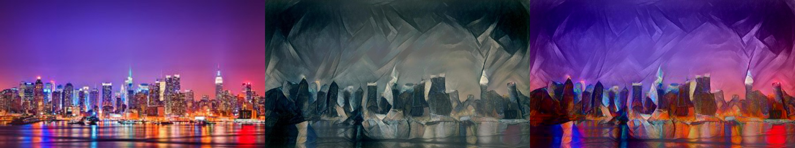

A Neural Algorithm of Artistic Style
=====================================================
(Review by [Cinjon Resnick](https://github.com/cinjon))

   In late August 2015, Gatys et al. from The University of Tübingen published [A Neural Algorithm of Artistic Style](http://arxiv.org/pdf/1508.06576v2.pdf). It demonstrated a way to present one piece of artwork in the style of a separate piece and subsequently swept across Facebook walls around the world. In short, it captured the public’s attention and made them recognize that the tools we had been building for imaging applications could be used to create imaginative art.

   So how did it work?

  

   The paper posits a technique for combining the style from input image *S* and the content from input image *C*. In the above picture, "Starry Tübingen", *S* is Starry Night by Van Gogh and *C* is a picture of Tübingen University. The technique involves constructing an [energy minimization](https://en.wikipedia.org/wiki/Mathematical_optimization#Optimization_problems) problem consisting of a style loss *Ls* and a content loss *Lc*. The key idea is to use a deep convolutional network ([VGG-19](http://www.robots.ox.ac.uk/~vgg/research/very_deep/)) that has a hierarchical understanding of images. For style, the model extracts correlations from VGG among features at multiple layers. And for content, it matches the representation from a particular layer.

   The content loss was defined above to be a straightforward L2 difference at a particular layer. More specifically, for *Lc*, it uses layer *conv4_2* and computes *½* the squared error loss between the output of *X* and that of *C*. 

   However, for style loss, the paper uses Gram matrices, which is defined as the inner product matrix between each of the vectorized feature maps at a given layer. Empirically, these are a very good proxy for feature correlations, and so the L2 difference between the Gram matrix of one image and that of another works well as a way to compare how close they are in style. For a more intuitive explanation, if we think of the algorithm like texture modeling, then the Gram matrix can be thought of as a spatial summary statistic on the feature responses. Aligning those statistics is a good proxy for being similar style-wise. 

   Consequently, *Ls* is computed using the mean squared error between the Gram matrices. For each of layers *conv1_1*, *conv2_1*, *conv3_1*, *conv4_1*, and *conv5_1*, we compute the mean squared error between the Gram matrices for *X* and *S*. The sum of these errors form the style error *Ls*.

   Starting with a white noise image for *X* and then jointly minimizing both of these losses with [L-BFGS](https://en.wikipedia.org/wiki/Limited-memory_BFGS) produces the style transfer effect. There is some tuning to do of course, with the weighting parameters for *Lc* and *Ls* being somewhat dependent on *C* and *S*. Initializing *X* to one of the images arguably works a little better, but also makes the result deterministic. In practice, the network will first match the low-level style features of the painting and then gradually correct toward the content of the image. Each image takes on the order of 3-5 minutes to complete on a GPU. Note also that its efficacy over different image inputs does change based on which convolutional network is used. For example, a network trained on face detection will do a better job at style transfer for faces.

   This work’s contribution extended beyond its machine learning approaches. It also had a positive effect on public perception and in attracting a diverse new crowd of practitioners. Since it debuted and cut a new trail, there have been many more works both making improvements to its efficacy as well as adapting it to new domains. We’ll briefly describe three of them here: Color-Preserving Style Transfer, Style Transfer for Videos, and Instant Style Transfer.

Color-Preserving Style Transfer
------------

   We start with the most recent innovation in this space. This [paper](https://arxiv.org/pdf/1606.05897.pdf) by Gatys et al amends the original style transfer approach by having it preserve the color of the content image. There are two methods described. The first works by transforming the style image’s color scheme to match the content image’s color scheme. This new *S’* is then used as the style input instead of the prior *S*. They elucidate two different linear transformations to accomplish this.

   The other method explained is a transfer in luminance space only. Extract first the luminance channels from *S* and *C* and then apply style transfer in that domain before imprinting the color channels over the style-transferred output. There is a brief discussion comparing the advantages and drawbacks of these methods as well. You can see the output in the picture below, where they've taken Picasso's Seated Nude and transferred its style onto a picture of New York City at night, but preserved the color scheme of the original.

  

Artistic Style Transfer for Videos
------------

   This [paper](https://arxiv.org/abs/1604.08610) by Ruder et al asks what happens if we try and apply style transfer to videos. It notes that naïvely applying Gatys’s algorithm independently to a sequence of frames "leads to flickering and false discontinuities, since the solution of the style transfer task is not stable." It then describes how to regularize the transfer using a method called [optical flow](tps://en.wikipedia.org/wiki/Optical_flow), for which it utilizes state of the art estimation algorithms [DeepFlow](http://lear.inrialpes.fr/src/deepflow/) and [EpicFlow](http://arxiv.org/abs/1501.02565).

   Further, they enforce even stronger consistency across frames with a few more methods. This includes detecting dis-occluded regions and motion boundaries by running the optical flow in both directions, as well as accounting for long-term consistency by penalizing deviations from temporally distant frames.

   The results are quite impressive though. The frames, while not seamless, are impressively consistent. You can see an example at [YouTube](https://www.youtube.com/watch?v=Khuj4ASldmU) here.

Instant Style Transfer
------------

   This [paper](https://arxiv.org/abs/1603.08155) by Johnson et al. asks and answers the question of speed. Both Gatys and Ruder’s works have lengthy optimization steps that take 3-5 minutes to compute per frame. The authors here modify the setup and prepend VGG with another deep network called the “Image Transformer Network” (ITN). The end result is that this produces an image that satisfies Gatys’s optimization step with just one forward pass.

   The way it works is that it pre-sets the style image *S* and then treats VGG as a black box that returns the sum of the style and content losses given *S*. The input to the ITN is the content image *C* that we want to transfer. We train it to transform *C* into *C’* by optimizing the style and content losses. We can do this without the lengthy optimization forward and backward passes that characterize Gatys’s original work because we are keeping *S* stationary for all *C*.

   It’s up for debate whether this loses or gains in quality. What is clear, however, is that it’s the only model we have today that can perform style transfer at fifteen frames per second.

Future Steps
------------

   This is a really interesting domain because there is so many directions we can imagine and create. What about starting from what we know and making them better, like real time optical flow? Or how about developing new art-forms for this domain, like transferring characters from movie scenes seamlessly? Or what about whole new domains, like music? Let’s hear Dylan do Disney.

*Images used in this summary were taken from the papers referenced.